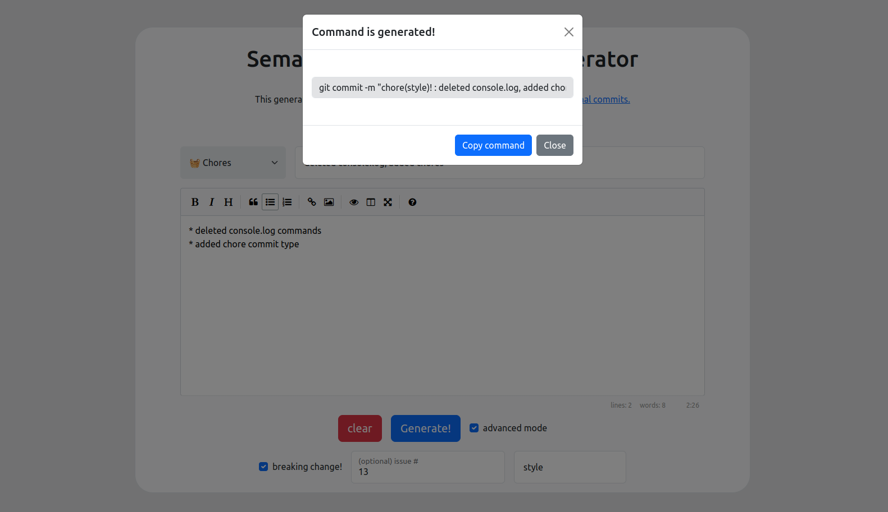

# semantic-commit-writer

|  |  | 

This website generates semantic commit messages easily. This generator generates on semantic commit message rule based on [conventional commits](https://www.conventionalcommits.org/).

[Check deployed version!](https://2ood.github.io/semantic-commit-writer)


## Write your commit messages easily.
This generator is useful in following aspects:

1. **Follow commit conventions** : any other programmers can easily understand your commit.
2. **Keep commit concise** : using types only from given commit types makes our commit logs concise.
3. **Easy to use** : it is web-based, easy to use.
4. **markdown supported** : the description is written on markdown editor.
5. **fast, light-weight** : it is built with bootstrap5, and other codes are written in vanilla javascript. 
6. Lively deployed by **Github page**.

## How to use
### 1. Fill in the inputs.

Commit type and commit title is required. Other fields are optional.
If you check advanced mode, you can add more complex commit commands.


### 2. Generate!

Once required fields are filled out, `generate` button will be enabled.
When you press it, a modal will pop up, showing the generated command.
You can copy the generated command with `Copy command` button.

 

3. use it in CLI
Open the terminal in the directory you are working on (that's managed with git) and paste as follows
```bash
$ git add -A
$ ## paste what you copied ##
$ git push
```

## Used Tech / Dependencies
* [bootstrap5](https://getbootstrap.com/docs/5.3/getting-started/introduction/)
* [easy-markdown-editor](https://github.com/Ionaru/easy-markdown-editor)